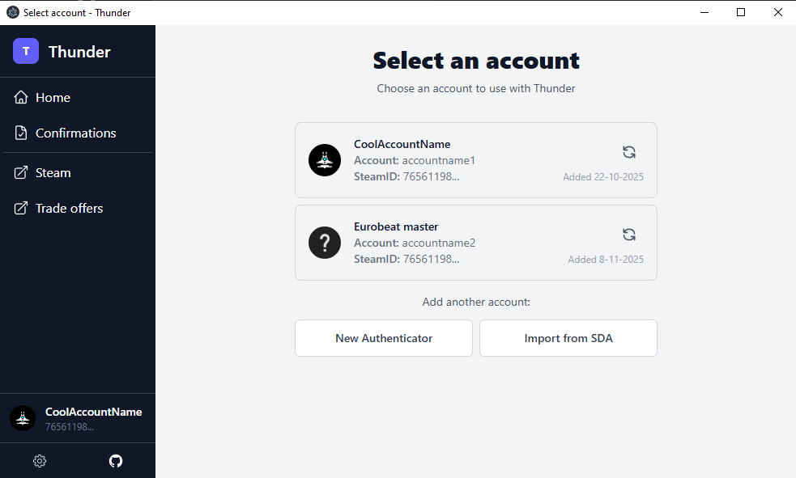
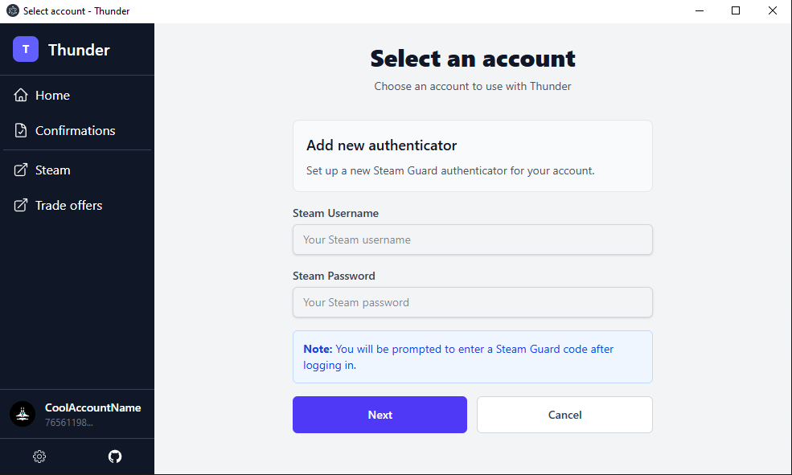
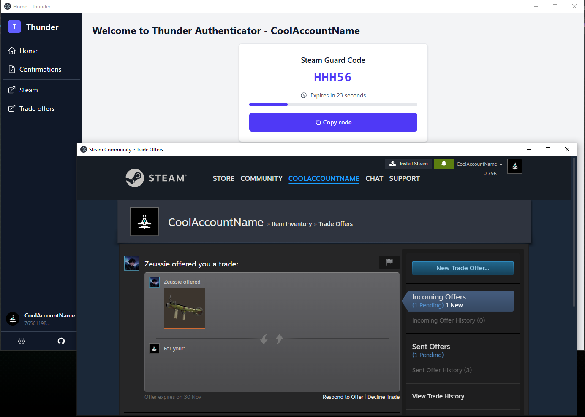

# Thunder Authenticator

Thunder is a 3rd party desktop authenticator and account manager for Steam. You can use it to generate Steam Guard codes, confirm trades/market transactions, and use the steam website within the app logged in as your selected account without needing to use a mobile phone.

### Table of Contents
- [Features](#features)
- [Download](#download)
- [Showcase images](#showcase-images)
- [Development quickstart](#development-quickstart)

## First, a word of caution:

> [!WARNING] 
> IF YOU HAVE A MOBILE PHONE, USE THE OFFICIAL STEAM MOBILE AUTHENTICATOR INSTEAD. The whole purpose of 2FA is to protect your account, and using a desktop authenticator is inherently less secure than using a mobile one. Only use this if you don't have a phone or have a good reason not to use the official app!

> [!CAUTION]
> IF you lost your config file or forgot your password, go [here](https://store.steampowered.com/twofactor/manage) and click "Remove authenticator" then enter the revocation code that you saved when you first set up the authenticator. This will remove the authenticator from your account, allowing you to set it up again.

Now onto the good stuff

## Features
- Password login, used to encrypt your account data locally
- Generate Steam Guard codes for any number of accounts
- Confirm trades and market transactions
- View the Steam website within the app logged in as your selected account
- Easily import existing accounts from Steam Desktop Authenticator
- Export account information for use in for example trading bots

### Planned features
- Adding tags or notes to accounts for easier organization

Have other feature ideas? Let me know by opening an [issue](https://github.com/ZeusJunior/thunder/issues/new)!

## Download
You can download the latest release for your system from the [releases page](https://github.com/ZeusJunior/thunder/releases/latest).

## Showcase images
Selecting an account to use, if there are 5 or more a search box will appear


Adding a new account


Viewing your confirmations


Using the Steam website within the app


## Development quickstart

```
$ cd thunder
$ yarn install

# start dev server
$ yarn dev

# or build for production
$ yarn build
```
